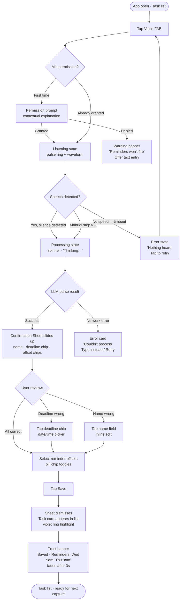
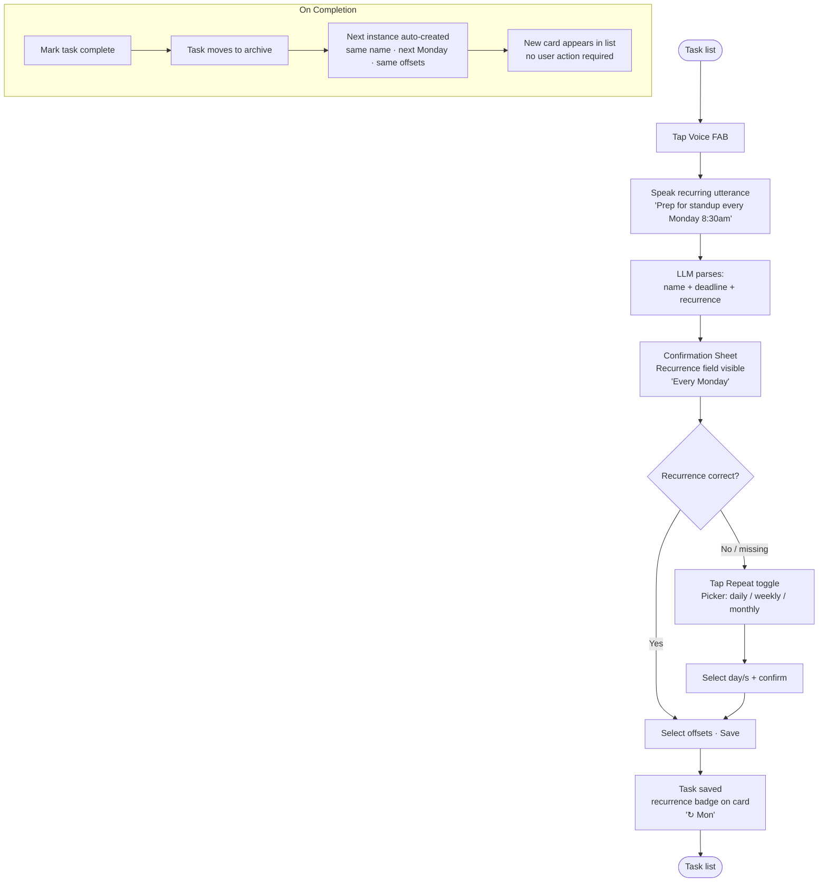
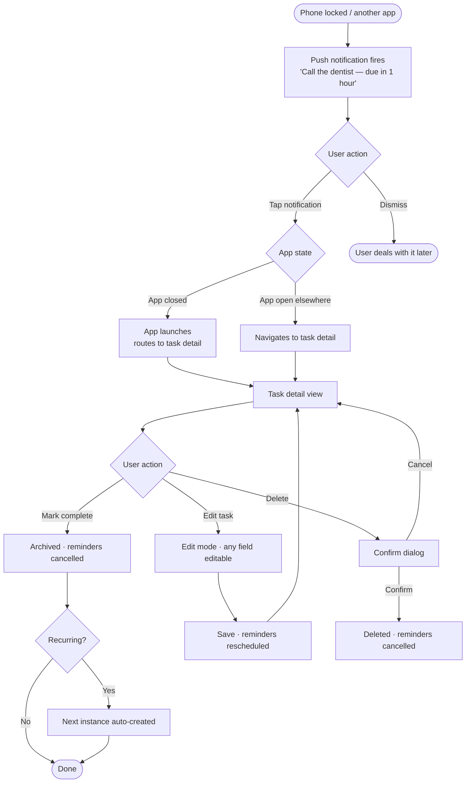

# User Journey Flows

## UJ-1: Capture a Task by Voice

**Key UX decisions in this flow:**
- Mic permission prompt fires on first FAB tap, not on app open — reduces friction at launch
- Network error offers text entry as immediate fallback — never a dead end
- Save button disabled until name + deadline both populated — prevents invalid saves silently
- Trust banner is specific (actual times, not just "saved") — eliminates post-save doubt

## UJ-2: Set Up a Recurring Task

**Key UX decisions:**
- Recurrence field shown on Confirmation Screen only when parsed — not always visible (reduces noise for one-off tasks)
- Recurrence badge `↻ Mon` on task card communicates the pattern without opening detail
- Auto-continuation is fully silent — no prompt, no modal, card just appears

## UJ-3: Act on a Notification

## Journey Patterns

**Navigation patterns:**
- Modal sheet for all creation/edit flows — never full-screen navigation for task entry
- Back arrow only on task detail; all other navigation is sheet dismiss (swipe down or Cancel)
- Notification tap always deep-links to task detail, bypassing the task list

**Decision patterns:**
- Destructive actions (delete, end series) require a confirmation dialog — all others execute immediately
- Save is always the primary CTA, full-width, at the bottom of the sheet
- Inline edit on Confirmation Screen (tap field to edit) — no separate "edit mode" on that screen

**Feedback patterns:**
- State transitions always acknowledged: listening → processing → result; save → banner; complete → archive
- Errors presented inline with a clear recovery action — never a blocking alert
- Success states are brief and specific — trust banner fades, task card settles to normal

## Flow Optimization Principles

1. **No dead ends.** Every error state offers at least one recovery action (retry, type instead, cancel).
2. **Minimal confirmation dialogs.** Only destructive/irreversible actions prompt; everything else executes immediately.
3. **Auto-advance where intent is clear.** Silence detection ends recording automatically; recurring next-instance creates without user action.
4. **Deep-link everything from notifications.** Tapping a notification lands on the task, never on the task list.
